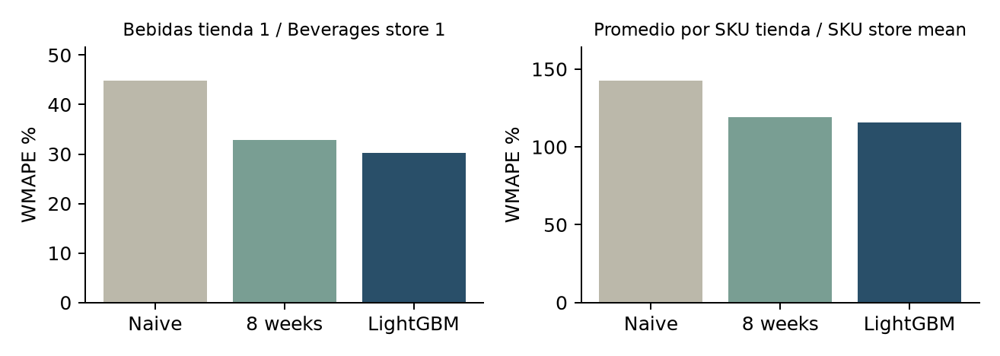

# Pronóstico para un piloto de reposición / Forecasting for a replenishment pilot

**Camilo Vergara · Data Analyst · Caso de portafolio / Portfolio case**

LightGBM recursivo fue seleccionado mediante validación temporal. Usarlo en un piloto en sombra: el desempeño agregado mejora, pero la demanda intermitente mantiene un error alto por SKU y tienda.

Recursive LightGBM was selected through temporal validation. Use it in a shadow pilot: aggregate performance improves, but intermittent demand leaves substantial SKU-store error.

## Alcance / Scope

Datos sintéticos con semilla 42. 110.624 registros originales, 60 productos, seis tiendas y 360 series. El calendario completo contiene 213.480 filas entre enero de 2015 y agosto de 2016.

Synthetic data, seed 42. 110,624 source records, 60 products, six stores and 360 series. The completed calendar contains 213,480 rows from January 2015 to August 2016.

| Indicador / Metric | Resultado / Result |
|---|---:|
| Bebidas tienda 1 / Beverages store 1 | WMAPE 30.28% |
| Baseline estacional / Seasonal naive | WMAPE 44.89% |
| Media por SKU tienda / SKU-store mean | WMAPE 115.56% |
| Validación / Validation | 4 folds + final 15 days |

## Revisar el caso / Review the case

- [Informe ejecutivo bilingüe / Bilingual executive report](reports/Executive_Report.pdf)
- [Decisión, método y límites / Decision, method and limitations](DECISION_REVIEW.md)
- [Diccionario / Data dictionary](docs/DATA_DICTIONARY.md)
- [Reproducción / Reproduction](REPRODUCIBILITY.md)
- [Verificación / Verification](docs/VALIDATION.md)
- [Tableau: libro empaquetado con extractos / packaged workbook](dashboard/reviewed/Replenishment.twbx)
- [Resultados por corte / Fold results](outputs/complete_backtest.csv)
- [Resultados por SKU / SKU-level evidence](outputs/complete_sku_errors.csv)

## Interpretación / Interpretation

La mejora predictiva no es ahorro de inventario. WMAPE puede superar 100% cuando la demanda es baja e intermitente. Los ceros se reconstruyen solo por el contrato del generador; retornos negativos se tratan como cero para este objetivo. No extrapolar esta regla a datos reales.

Forecast improvement is not inventory savings. WMAPE can exceed 100% for low, intermittent demand. Zeros are reconstructed only under the generator contract; negative returns become zero for this target. Do not apply this rule to real data without validation.

[Open reviewed dashboard / Abrir dashboard revisado en Tableau Public](https://public.tableau.com/app/profile/camilo.vergara3198/viz/Replenishment_17889686809270/SyntheticreplenishmentReposicionsimulada)

Public access verified; four reviewed charts, synthetic 60-product × 6-store scope.
