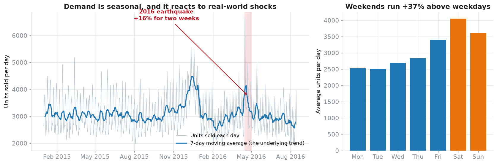
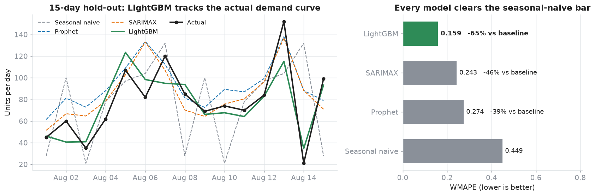
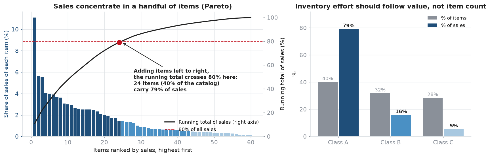
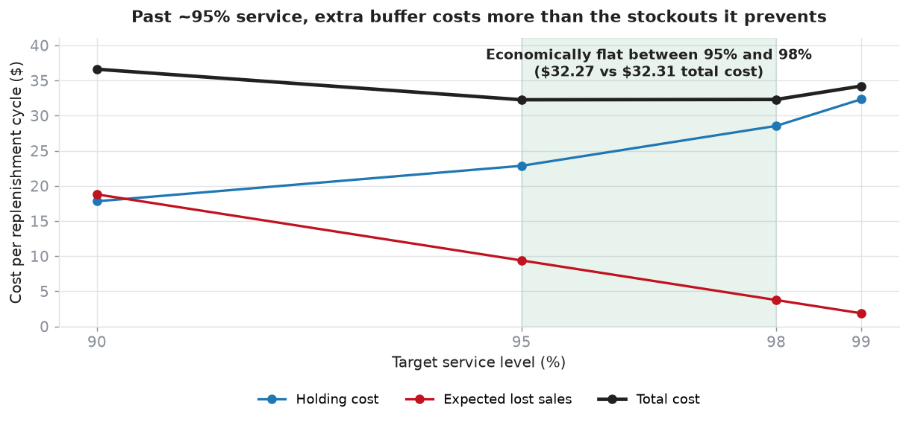
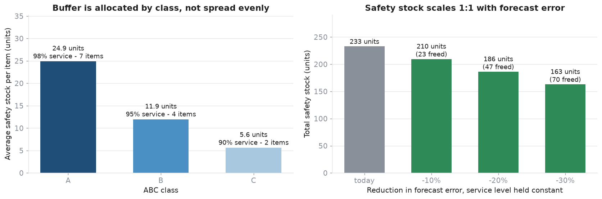

# Demand Forecasting and Replenishment Policy for an Ecuadorian Grocery Chain, 2015 to 2016

**Store-item demand forecast, the error measured out of sample, and a safety stock and reorder point derived for every item.**

Built by [Camilo Vergara Salas](https://www.linkedin.com/in/camilo-evs) · [GitHub](https://github.com/Chrov)<br>
Stack: **dbt · DuckDB · Python (LightGBM, SARIMAX, Prophet) · SQL**<br>
Data: **synthetic replica** of the Kaggle Corporación Favorita dataset — see [The data](#the-data) and [Limitations](#limitations)

---

## Bottom line

| | |
|---|---|
| **Forecast** | Error cut **65%** against the seasonal-naive rule a planner would otherwise use (WMAPE 0.449 → 0.159 on a 15-day hold-out) |
| **Decision** | A reorder point and safety-stock target for every item, with the service level set by ABC class (A 98% · B 95% · C 90%) |
| **Prioritization** | 24 of 60 items (40%) carry **79%** of sales — buffer follows value, not item count |
| **Sensitivity** | Safety stock is linear in forecast error: every 10% of error removed releases 10% of the buffer (23 of 233 units here) at an unchanged service level |

Build decisions, validation protocol and formulas: **[METHODOLOGY.md](METHODOLOGY.md)**.

---

## The business problem

A grocery chain answers the same question every day, for every item, in every store: **how much do we order?**

Two ways to get it wrong, pulling in opposite directions:

- **Order too little** → empty shelf, lost sale, customer walks to the competitor.
- **Order too much** → capital frozen in a warehouse and, for perishables, product thrown away.

Forecast accuracy moves both at once: a smaller forecast error allows a **smaller buffer at the same service level**, which is working capital released and spoilage avoided. The chain from forecast to order:

> forecast → forecast error (σ) → safety stock → reorder point → cost of the chosen service level

---

## The data

The [Corporación Favorita Grocery Sales Forecasting](https://www.kaggle.com/c/favorita-grocery-sales-forecasting) dataset: an Ecuadorian retailer, ~125M rows of item-store-day sales, plus store metadata, item attributes (including a `perishable` flag), daily WTI oil prices (Ecuador is oil-dependent — a proxy for purchasing power) and national holidays.

That data is gated behind a Kaggle account, rules acceptance and a ~5 GB download. This repository therefore runs on a [synthetic generator](data/generate_synthetic_favorita.py) that emits the same six tables with the same schema, carrying the signals the analysis looks for: weekly seasonality, the Ecuadorian payday cycle, promotional lift, the April 2016 earthquake shock, oil correlation and perishable volatility.

| | Real Kaggle dataset | This repo (MVP scale) |
|---|---|---|
| Rows | ~125,000,000 | 110,624 |
| Stores / items / families | 54 / ~4,000 / 33 | 6 / 60 / 8 |
| Period | 2013-01 → 2017-08 | 2015-01-01 → 2016-08-15 (593 days) |

**The pipeline is identical for the real data** — only the source changes. The [dbt migration guide](dbt/README.md#migrate-to-bigquery-real-kaggle-dataset) documents pointing it at the real CSVs in BigQuery.

---

## Results

### 1. Demand structure, and the features it justifies



| Signal | Measured | What it changed in the model |
|---|---|---|
| Weekly seasonality | Weekends **+37%** vs weekdays | Period-7 seasonality is mandatory (SARIMAX `s=7`, Prophet weekly) |
| Payday cycle | **+13.7%** around the 15th and month-end | `is_payday` calendar feature |
| Promotions | Lift of **1.30× to 1.97×**, varying by family | `onpromotion` as a regressor in every model |
| Earthquake (2016-04-16) | **+16%** for the two following weeks | Changepoints in Prophet; an event flag in production |
| Oil price | Correlation of **0.22** with aggregate demand — weak | `oil_price` kept as a macro regressor, with modest expectations |
| Perishables | Within-series CV **0.56** vs 0.53 — marginally more volatile | 1.25× perishable weight in NWRMSLE, stricter inventory treatment |

The last row uses a within-series measure because the pooled one gives the opposite answer. Pooling every row and comparing coefficients of variation makes perishables look *less* volatile (0.93 vs 1.01), but that statistic mixes variation between items with variation within each item over time, and the non-perishable families span a much wider range of average volumes (2.5 to 77 units/day, against 3.2 to 28). Compared series by series — the quantity safety stock depends on — perishables come out slightly more volatile. Full check in [METHODOLOGY.md](METHODOLOGY.md#64-the-perishable-volatility-trap).

### 2. The forecast beats the operating baseline by 65%



**Seasonal naive** — "this Tuesday will sell what last Tuesday sold" — is close to how a good deal of replenishment actually runs, and it captures the strongest signal in the series for free. Every model has to clear it.

| Model | WMAPE (15-day hold-out) | vs baseline | Walk-forward, 4 folds |
|---|---|---|---|
| Seasonal naive | 0.449 | — | 0.407 ± 0.063 |
| Prophet | 0.274 | −39% | 0.262 ± 0.017 |
| SARIMAX | 0.243 | −46% | 0.258 ± 0.028 |
| **LightGBM** | **0.159** | **−65%** | *not yet backtested* |

- **Validation is time-based, never random k-fold.** A random split leaks future observations into training and produces metrics that evaporate in production.
- **Across folds, Prophet and SARIMAX are indistinguishable** (0.262 vs 0.258, well inside one standard deviation). Their hold-out ranking was luck. LightGBM's lead is large enough to be interesting but rests on one hold-out — see [Limitations](#limitations).

LightGBM's top features are the ones a planner would name: 28-day rolling mean, promotion flag, day of week. Every lag and rolling statistic is computed per series with `shift()`, so no feature sees the future.

### 3. Not every item deserves the same buffer



**Class A (40% of items) carries 79% of sales.** Protecting those at a high service level and class C at a lower one puts the buffer where the revenue is. The classification lives in dbt (`mart_item_abc`), not in notebook code, so BI and Python read the same definition.

### 4. The "optimal" service level is a range, not a point



Holding cost rises with the service level; expected lost sales fall. Total cost is U-shaped, so the service level has an answer in the data rather than being set by convention.

Between 95% and 98% total cost moves from $32.27 to $32.31, a 0.1% difference. Anything in that band is economically equivalent, so the choice inside it should be made on grounds the model doesn't see — shelf space, supplier minimums, how visible a stockout is to the customer. Reading a hard optimum off this curve would be false precision.

### 5. What a lower forecast error releases



Safety stock follows `z × σ_error × √lead_time`, so it is **linear in forecast error**: cut σ by 20% and the buffer drops 20% at an identical service level. Across the 13 items modeled that is 47 of 233 units freed.

[`outputs/inventory_policy.csv`](outputs/inventory_policy.csv) holds one row per item:

| item_nbr | abc | service_level | safety_stock | reorder_point |
|---|---|---|---|---|
| 100023 | A | 98% | 57.1 | 119.8 |
| 100031 | A | 98% | 31.5 | 84.4 |
| 100021 | B | 95% | 19.2 | 39.9 |
| 100025 | C | 90% | 5.6 | 19.6 |

When stock on hand reaches the reorder point, place the order.

---

## How it's built

```
  data/raw/*.csv    ──►    dbt on DuckDB    ──►    notebooks 01–03    ──►    outputs/
  6 source tables           11 models              EDA → forecast          inventory_policy.csv
  synthetic generator       21 data tests          → inventory             forecast_error_by_item.csv
  or real Kaggle CSVs       star schema:                                    reports/figures/*.png
                            fct_sales + 4 dims                              dashboard/data/*.csv
                            + mart_item_abc                                 (flat, BI-ready)
```

`fct_sales` (store-item-day grain) plus four conformed dimensions form the star schema, queryable directly by a BI tool or an analyst. The ABC classification is a dbt model rather than notebook code, so every consumer reads one definition.

**Method notes:**

- **WMAPE as the primary metric.** Item-store-day retail demand is full of zeros and plain MAPE explodes on them. RMSE and NWRMSLE (the competition's official metric, weighting perishables 1.25×) are reported alongside.
- **Aggregation chosen deliberately.** Series models run on smoother family-store-day aggregates; LightGBM runs at item-store-day grain with a `tweedie` objective built for intermittency.
- **Model selection weighs more than accuracy.** A sensible production split is a global LightGBM for the long tail plus interpretable series models — which come with native prediction intervals, useful for safety stock — on high-value class-A SKUs.

---

## Run it

Everything runs locally on DuckDB. No cloud account, no credentials.

```bash
pip install -r requirements.txt
python data/generate_synthetic_favorita.py --scale mvp
```

```bash
cd dbt && dbt run-operation load_raw_sources --profiles-dir . && dbt run --profiles-dir . && dbt test --profiles-dir . && cd ..
```

Then run the notebooks in order — [`01_eda`](notebooks/01_eda.ipynb) → [`02_forecasting`](notebooks/02_forecasting.ipynb) → [`03_inventory`](notebooks/03_inventory.ipynb) — and, optionally, re-render the charts in this README:

```bash
python reports/make_figures.py
```

---

## Limitations

1. **The data is synthetic.** It mirrors the real schema and its signals, but weakly in places: the oil correlation is 0.22 and the perishable volatility gap is marginal (within-series CV 0.56 vs 0.53). Results demonstrate the method; they are not findings about Corporación Favorita.
2. **The modeling scope is an MVP slice** — one family-store (BEVERAGES, store 1) for the forecast, 13 items for the inventory policy. The filter is a constant at the top of notebook 02; extending it does not require redesign.
3. **LightGBM's 0.159 is one 15-day hold-out.** The walk-forward backtest covers baseline, Prophet and SARIMAX only. A rigorous LightGBM backtest has to regenerate lags and rolling features at every cutoff; until that runs, treat the −65% as promising rather than settled.
4. **The model comparison is not fully apples to apples.** LightGBM predicts at item grain and is scored after summing to the daily total, so some of its edge is error cancellation across items. That is a real benefit of the finer grain, but it isn't the same experiment the series models ran.
5. **The cost curve uses assumed unit economics** ($0.50 per unit held per cycle, $3.00 sale price, lost sales approximated as linear in `1 − service level`) and is evaluated on a four-point grid. With real margin and spoilage data it would calibrate to the business — and the optimum would still be a range.
6. **"20% less error frees 20% of buffer" is arithmetic, not a finding.** It follows from the safety-stock formula. The empirical claim is the measured error reduction; converting that into a per-item buffer delta needs the baseline model's σ per item, which was not computed.
7. **Lead time is fixed at 3 days and treated as deterministic.** Real replenishment has variable lead time, which needs the fuller `√(L·σ_d² + d²·σ_L²)` form.

---

## Next steps

1. Backtest LightGBM with per-fold feature regeneration — confirm or retire the hold-out win.
2. Lift the MVP filter and run the full catalog.
3. Calibrate the cost curve with real margin, holding and spoilage rates; add stochastic lead time.
4. Publish the operations view (Tableau/Power BI) on the extracts already exported to `dashboard/data/`.
5. Run against the real Kaggle data on BigQuery via the [migration guide](dbt/README.md#migrate-to-bigquery-real-kaggle-dataset).

---

## Repository map

```
├── METHODOLOGY.md                        Build decisions, validation, formulas
├── data/generate_synthetic_favorita.py   Synthetic dataset with the Favorita schema
├── dbt/                                  Star schema: 11 models, 21 tests (+ BigQuery guide)
├── notebooks/                            01 EDA · 02 forecasting · 03 inventory
├── src/forecasting_pipeline.py           Reusable metrics, backtesting and inventory formulas
├── reports/make_figures.py               Renders the charts in this README
├── dashboard/                            Flat, BI-ready extracts (one file per view)
├── sql/01_bigquery_setup.sql             Analysis queries for the real-data path
└── outputs/                              inventory_policy.csv · forecast_error_by_item.csv
```
